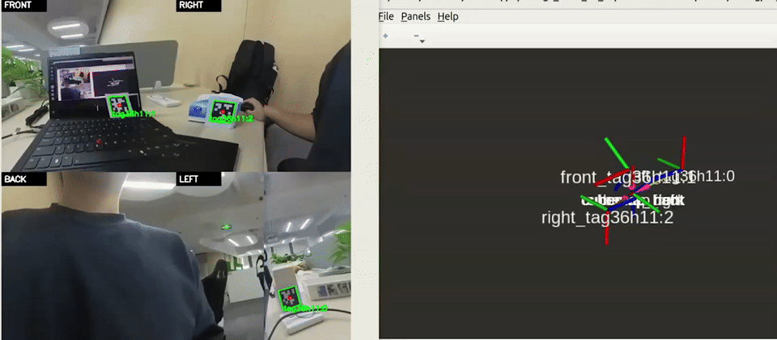
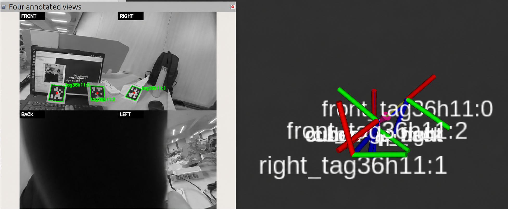

# Insta360 X3 cubemap AprilTag workflow

This ROS 2 Jazzy project turns an Insta360 X3 stream into four 360 × 360
views (front, right, back, left). It can record all four views in one SQLite
ROS bag, run four AprilTag detectors, show a 2 × 2 annotated image and TF in
RViz, and measure camera and detector frequencies.

The proprietary Insta360 CameraSDK and recordings are kept outside this
repository. No camera data is needed to build the project or replay an
existing bag.

## Demo





## Requirements and one-command setup

- Ubuntu 24.04 with ROS 2 Jazzy installed.
- For live recording: an Insta360 X3 connected by USB-C in Android USB mode.
- The Insta360 CameraSDK extracted outside this checkout, usually under a
  sibling `../sdk/<CameraSDK folder>/`. Alternatively, set `INSTA360_SDK_DIR`
  to the directory containing `include/camera/camera.h`,
  `include/stream/stream_delegate.h`, and `lib/libCameraSDK.so`.

From the repository root, run:

```bash
./setup_x3.sh
```

This checks ROS, AprilTag, OpenCV, FFmpeg, RViz, and terminal dependencies,
finds the SDK, and builds the two ROS packages into `install/`. If a system
dependency is missing, on Ubuntu with the ROS apt repository configured use:

```bash
sudo apt install -y build-essential cmake pkg-config libopencv-dev libavcodec-dev libavformat-dev libavutil-dev libswscale-dev python3-opencv python3-numpy python3-yaml gnome-terminal ros-jazzy-desktop ros-jazzy-apriltag-ros ros-jazzy-apriltag-msgs ros-jazzy-cv-bridge ros-jazzy-rosbag2
```

If the camera is visible in `lsusb` but the SDK reports no available device,
run `src/insta360_ros_driver/scripts/setup_udev.sh`, then log out and back in
and reconnect the X3. This step changes system USB permissions and may prompt
for an administrator password.

## Record with four detectors and RViz

Choose a **new** absolute bag path. The example name below is illustrative;
replace it for each take. `0.06` means a 60 mm tag edge length in metres.

```bash
./start_x3_four_rviz.sh record "$HOME/Videos/x3_tests/example_take" 0.06
```

The launcher opens terminals for the camera and bag recorder, four detectors,
annotated images, TF, and RViz. The default live ROS domain is **0**. Wait for
`Recording SQLite ROS 2 bag (.db3)` before filming. Press Ctrl+C in the
`X3 recording` terminal to finish the bag, then close the other terminals.

The bag contains H.264 dual fisheye data, a JPEG panorama, four raw cubemap
faces with matching `CameraInfo`, a JPEG mosaic, and IMU data. It contains
`metadata.yaml` and a `.db3` file. Detector results are written separately
to four `*_detections.csv` files next to the bag.

### Record smaller grayscale cubemap images

After updating the checkout, rebuild once with `./setup_x3.sh`. To record the
same four faces, detectors, TF, and RViz view with `mono8` camera images, use:

```bash
./start_x3_four_mono8_rviz.sh record "$HOME/Videos/x3_tests/example_take_mono8" 0.06
```

The four `/cubemap/<face>/image` topics keep their 360 × 360 resolution and
`CameraInfo`. Their raw image payload changes from three bytes per pixel
(`bgr8`) to one (`mono8`) before ROS publishes and records it. The SQLite bag
still has a `.db3` file; the already compressed panorama, fisheye, and mosaic
topics are unchanged. Live AprilTag detection and the annotated RViz view run
as in the color workflow. Color is discarded from the four face images.

During recording, verify one face in another terminal:

```bash
source /opt/ros/jazzy/setup.bash
ros2 topic echo /cubemap/front/image --once --field encoding
```

It should print `mono8`. Use a new bag path for each take. To replay a mono8
bag, use the usual replay command below with that bag path.

## Replay with four detectors and RViz

```bash
./start_x3_four_rviz.sh replay "$HOME/Videos/x3_tests/example_take" 0.06
```

The replay loops on ROS domain **71** by default. RViz shows front and right
on the top row, back and left on the bottom row, plus tag TF. Per-face
detections are published at `/apriltag/<face>/detections`; the combined image
is `/apriltag/four_views/image_annotated`.

Use `--unmirror` after the tag size only for bags recorded before the front
mirror correction. The remapping keeps the mirrored source topic separate
from the corrected front image.

## Check all four camera and detector frequencies

While **recording**, run this in another terminal from the repository root:

```bash
./check_x3_rates.sh record 15
```

While **replaying**, use:

```bash
./check_x3_rates.sh replay 15
```

The final argument is the measurement duration in seconds. The script chooses
domain 0 or 71 to match the mode and reports all four camera and detector
topic rates in one table. `Tag frames` counts detector messages containing at
least one tag; the detector rate includes frames with no tags. To use a custom
domain, set the same `X3_FOUR_DOMAIN_ID` for both the launcher and checker.

For a manual front-view cross-check, source ROS in each measurement terminal,
then run one command per terminal during replay:

```bash
source /opt/ros/jazzy/setup.bash
ROS_DOMAIN_ID=71 ros2 topic hz /cubemap/front/image --window 30 --wall-time
```

```bash
source /opt/ros/jazzy/setup.bash
ROS_DOMAIN_ID=71 ros2 topic hz /apriltag/front/detections --window 30 --wall-time
```

Replace `front` with `right`, `back`, or `left` for the other views. For live
recording, use domain 0. `ros2 topic hz` measures a subscriber's receiving
rate, which can reflect computer load. `ros2 bag info BAG_PATH` shows the
recorded camera message counts and duration. This bag does not store detector
messages; replay starts the detector to measure its rate.

## Different tag sizes

The default family is `36h11`. Instead of `0.06`, pass a ROS parameter YAML
file to either launcher command. Each detector reads the same file. Example:

```yaml
/**:
  ros__parameters:
    family: 36h11
    size: 0.06
    tag:
      ids: [0, 1]
      sizes: [0.06, 0.10]
```

Listed IDs use their specified sizes; all other IDs use the default `size`.
Measure the AprilTag detection square edge, since an incorrect physical size
changes the reported pose scale.

## Camera model and TF

Each cubemap face has a 90-degree virtual pinhole `CameraInfo`. This is an
approximation of the stitched X3 panorama, so metric tag poses can be affected
by source-camera calibration and stitching. TF child names include the face
(for example, `front_tag36h11:0`) to keep simultaneous observations distinct.
The static links between the four camera frames use nominal 90-degree rotations
and coincident origins; they are for visualization, not measured lens
extrinsics. The pipeline does not generate a point cloud.
